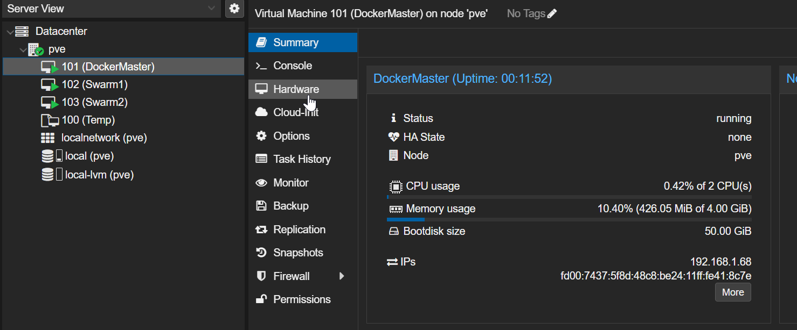
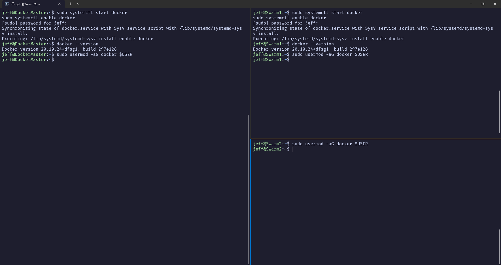
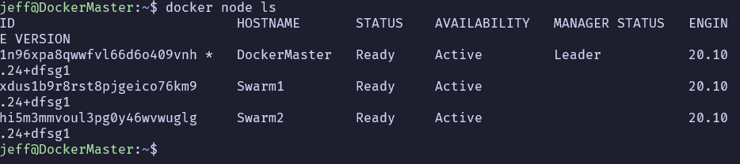
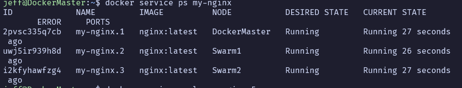
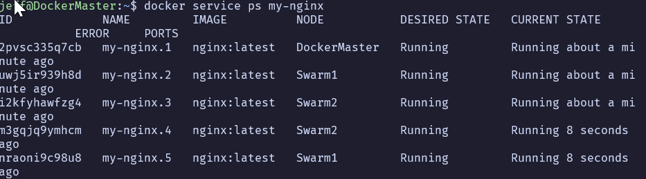
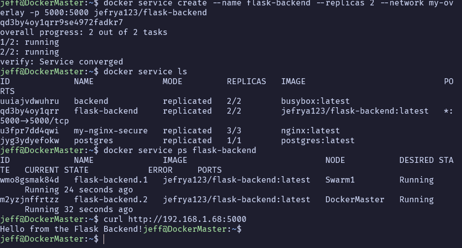
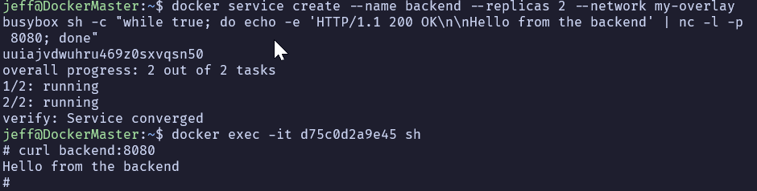
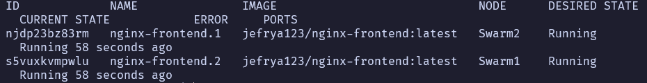
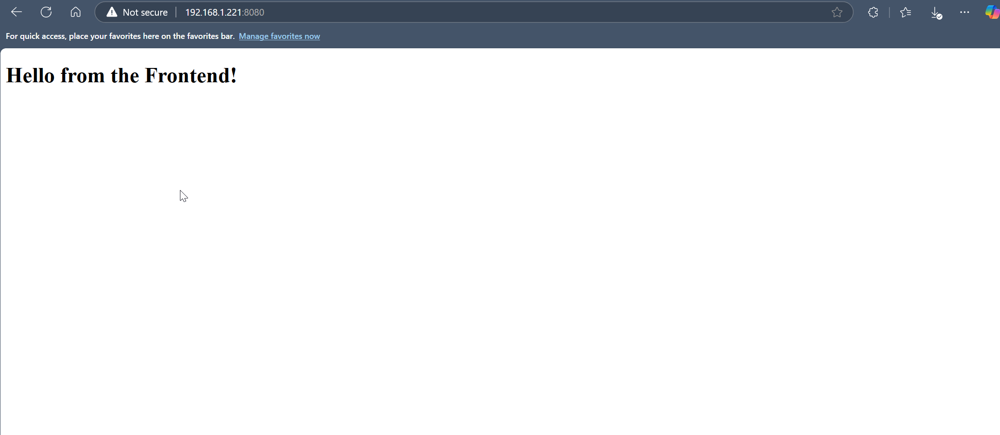

# Docker Swarm Setup Documentation

## Step 1: Setting Up Docker and Changing Hostnames

### Changing Hostnames

1. **Open the hostname file and set the new hostname**:
   ```bash
   sudo nano /etc/hostname
   ```
   - Example: Set the hostname to `master`, `swarm1`, or `swarm2` depending on the VM.

2. **Update the `/etc/hosts` file to match**:
   ```bash
   sudo nano /etc/hosts
   ```
   - Add the entry for the hostname:
     ```
     127.0.0.1   master
     ```

3. **Apply the changes**:
   ```bash
   sudo hostnamectl set-hostname <new-hostname>
   ```
   - Replace `<new-hostname>` with the desired hostname (e.g., `master`).

4. **Verify the new hostname**:
   ```bash
   hostname
   ```



---

### Installing Docker

1. **Update and upgrade the package manager**:
   ```bash
   sudo apt-get update && sudo apt-get upgrade -y
   ```

2. **Install Docker**:
   ```bash
   sudo apt-get install docker.io -y
   ```

3. **Start and enable Docker**:
   ```bash
   sudo systemctl start docker
   sudo systemctl enable docker
   ```

4. **Verify the installation**:
   ```bash
   docker --version
   ```



---

## Step 2: Initializing Docker Swarm

### Initialize the Swarm on the Manager Node

1. **Run the following command on the `master` node**:
   ```bash
   docker swarm init --advertise-addr <master-node-ip>
   ```
   - Replace `<master-node-ip>` with the IP address of the `master` node.

2. **Verify Swarm Initialization**:
   ```bash
   docker info | grep -i "swarm"
   ```
   - Look for `Swarm: active` in the output.

### Node Listing


---

### Add Worker Nodes to the Swarm

1. **On the `master` node**, get the join token:
   ```bash
   docker swarm join-token worker
   ```

2. **Run the join command on each worker node**:
   ```bash
   docker swarm join --token SWMTKN-1-xyz123abc456... <master-node-ip>:2377
   ```

3. **Verify Worker Nodes are Added**:
   ```bash
   docker node ls
   ```




---

## Step 3: Deploying a Tangible Multi-Tier Application

### Step 3.1: Set Up the PostgreSQL Service
1. **Deploy PostgreSQL as a Swarm service**:
   ```bash
   docker service create --name postgres --replicas 1 --network my-overlay \
     -e POSTGRES_USER=admin -e POSTGRES_PASSWORD=secret -e POSTGRES_DB=mydb \
     postgres:latest
   ```

2. **Verify the PostgreSQL service**:
   ```bash
   docker service ps postgres
   ```

---

### Step 3.2: Set Up the Flask Backend
1. **Create the Flask Application**:
   - File: `app.py`
   ```python
   from flask import Flask
   import psycopg2

   app = Flask(__name__)

   @app.route("/")
   def hello():
       return "Hello from the Flask Backend!"

   if __name__ == "__main__":
       app.run(host="0.0.0.0", port=5000)
   ```

2. **Create a `Dockerfile`**:
   ```dockerfile
   FROM python:3.9-slim
   RUN apt-get update && apt-get install -y gcc libpq-dev
   WORKDIR /app
   COPY app.py .
   RUN pip install --upgrade pip && pip install flask psycopg2
   CMD ["python", "app.py"]
   ```

3. **Build and Push the Flask Image**:
   ```bash
   docker build -t <your-dockerhub-username>/flask-backend .
   docker push <your-dockerhub-username>/flask-backend
   ```

4. **Deploy the Flask Service**:
   ```bash
   docker service create --name flask-backend --replicas 2 --network my-overlay \
     -p 5000:5000 <your-dockerhub-username>/flask-backend
   ```

5. **Verify the Flask Service**:
   ```bash
   docker service ps flask-backend
   ```




---

### Step 3.3: Set Up the Nginx Frontend
1. **Create the Frontend HTML File**:
   - File: `index.html`
   ```html
   <!DOCTYPE html>
   <html>
   <head>
       <title>Frontend</title>
   </head>
   <body>
       <h1>Hello from the Frontend!</h1>
   </body>
   </html>
   ```

2. **Create a `Dockerfile`**:
   ```dockerfile
   FROM nginx:latest
   COPY index.html /usr/share/nginx/html/index.html
   ```

3. **Build and Push the Frontend Image**:
   ```bash
   docker build -t <your-dockerhub-username>/nginx-frontend .
   docker push <your-dockerhub-username>/nginx-frontend
   ```

4. **Deploy the Frontend Service**:
   ```bash
   docker service create --name nginx-frontend --replicas 2 --network my-overlay \
     -p 8080:80 <your-dockerhub-username>/nginx-frontend
   ```

5. **Verify the Frontend Service**:
   ```bash
   docker service ps nginx-frontend
   ```





